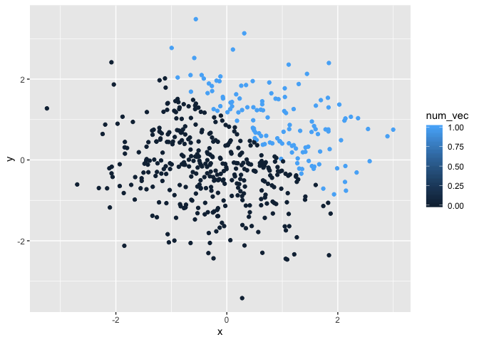
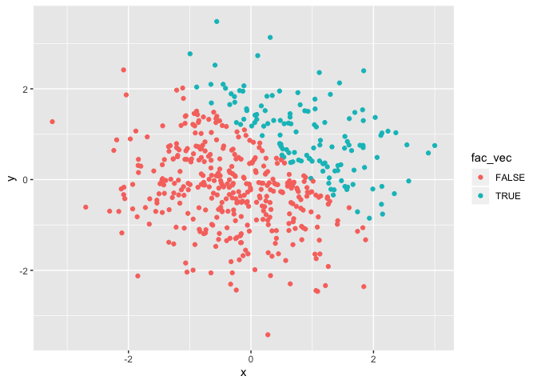

Data Science Homework 1
================
Keyanna Davis
9/14/2019

Problem 1
=========

This problem is intended to emphasize variable types and introduce coercion; some awareness of how R treats numeric, character, and factor variables is necessary for working with data types in practice.

The chunk of code below has a random size of 8 from a standard normal distribution, a logical vector indicating whether elements of the sample are greater than 0, a character vector of length 8, and a factor vector of length 8 with 3 different factor levels.

``` r
library(tidyverse)
```

    ## ── Attaching packages ─────────────────────────────────────────────────────────── tidyverse 1.2.1 ──

    ## ✔ ggplot2 3.2.1     ✔ purrr   0.3.2
    ## ✔ tibble  2.1.3     ✔ dplyr   0.8.3
    ## ✔ tidyr   0.8.3     ✔ stringr 1.4.0
    ## ✔ readr   1.3.1     ✔ forcats 0.4.0

    ## ── Conflicts ────────────────────────────────────────────────────────────── tidyverse_conflicts() ──
    ## ✖ dplyr::filter() masks stats::filter()
    ## ✖ dplyr::lag()    masks stats::lag()

``` r
rs_df = tibble(
    rand_samp =rnorm(8),
    rand_samp_vec =rand_samp > 0,
    vec_char = c("Hey", "my", "is", "Keyanna", "and", "I", "like", "math"),
    vec_factor = factor(c("true", "false", "unknown", "unknown", "true", "true", "false", "false")
    )
)
mean(rs_df)
```

    ## Warning in mean.default(rs_df): argument is not numeric or logical:
    ## returning NA

    ## [1] NA

``` r
mean(pull(rs_df, rand_samp))
```

    ## [1] -0.1255984

``` r
mean(pull(rs_df, rand_samp_vec))
```

    ## [1] 0.625

``` r
mean(pull(rs_df, vec_char))
```

    ## Warning in mean.default(pull(rs_df, vec_char)): argument is not numeric or
    ## logical: returning NA

    ## [1] NA

``` r
mean(pull(rs_df, vec_char))
```

    ## Warning in mean.default(pull(rs_df, vec_char)): argument is not numeric or
    ## logical: returning NA

    ## [1] NA

#### Problem1.1

The code chunk below applies the numeric function to the logical, character, and factor variables. What happens and why? Does this help explains what happens when you try to take the mean?

``` r
as.numeric(pull(rs_df, rand_samp_vec))
as.numeric(pull(rs_df, vec_char))
as.numeric(pull(rs_df, vec_factor))
```

When I applied the as.numeric function to the logical variables I recieved 1s and 0s which indicates the true values and false values, for the character variables I received NAs and a warning message: NAs introduced by coercion, and for the factor variable i received 1s, 2s , 3s which indicates the different factor levels. This explains why the mean could not be given when I tried to take the mean of each variable in the dataframe.

#### Problem1.2

The code chunk below consist of converting logical vectors to numeric vectors and/or factor vectors and after converting I will multiply the results by the random sample from the dataframe.

``` r
new_samp_num = as.numeric(pull(rs_df, rand_samp_vec))
new_samp_num * (pull(rs_df, rand_samp))
```

    ## [1] 0.5726912 0.6371598 0.0000000 0.7190729 0.0000000 0.2766457 0.6284902
    ## [8] 0.0000000

``` r
new_samp_fac = as.factor(pull(rs_df, rand_samp_vec))
new_samp_fac * (pull(rs_df, rand_samp))
```

    ## Warning in Ops.factor(new_samp_fac, (pull(rs_df, rand_samp))): '*' not
    ## meaningful for factors

    ## [1] NA NA NA NA NA NA NA NA

``` r
new_samp_fac_2 = as.factor(pull(rs_df, rand_samp_vec))
new_samp_num_2 = as.numeric(new_samp_fac_2)
new_samp_num_2 * (pull(rs_df, rand_samp))
```

    ## [1]  1.1453823  1.2743196 -0.4883093  1.4381459 -1.9676667  0.5532914
    ## [7]  1.2569803 -1.3828706

Problem 2
=========

This problem focuses the use of inline R code, plotting, and the behavior of ggplot for variables of different types.

The chunk of code below creates a dataframe comprised of x and y which both are a random sample of size 500 from a standard normal distribution. Its also a logical vector indicating whether x plus y is greater than 1. A numeric vector and a factor vector is created by coercing the logical vector.

``` r
library(tidyverse)

rsample_df = tibble(
  x = rnorm(500),
  y = rnorm(500),
  logical_vec = (x + y) > 1,
  num_vec = as.numeric(logical_vec),
  fac_vec = as.factor(logical_vec)
)
```

#### Problem 2.1

The number of rows in `rsample_df` is 500 and the number of columns is 5. The mean of `x` in the dataframe `rsample_df` is 0.0585977, the median is 0.0239805, and the standard deviation is 1.0269724. The number of proportion cases 0.284

#### Problem 2.2

The chunk of code below produces 3 scatterplots with color points which are a logical vector, numeric vector, and a factor vector. It also shows the where I saved the first plot.

``` r
plot_1 <-ggplot(rsample_df, aes(x=x, y=y, color=logical_vec)) + geom_point()
plot_1
```


``` r
plot_2 <-ggplot(rsample_df, aes(x=x, y=y, color=num_vec)) + geom_point()
plot_2
```



``` r
plot_3 <-ggplot(rsample_df, aes(x=x, y=y, color=fac_vec)) + geom_point()
plot_3
```



``` r
ggsave("plot_1.pdf", height=4, width=6)
```

Plot 1 shows the logical vector where the red is false and blue indicates true.

Plot 2 shows the numeric vector where the scales is from 0 to 1, with 0 being the darker blue and as it goes up the scale the color get lighter where 1 is the lightest blue.

Plot 3 shows the factor vector where the red incates false and the blue indicates true.
